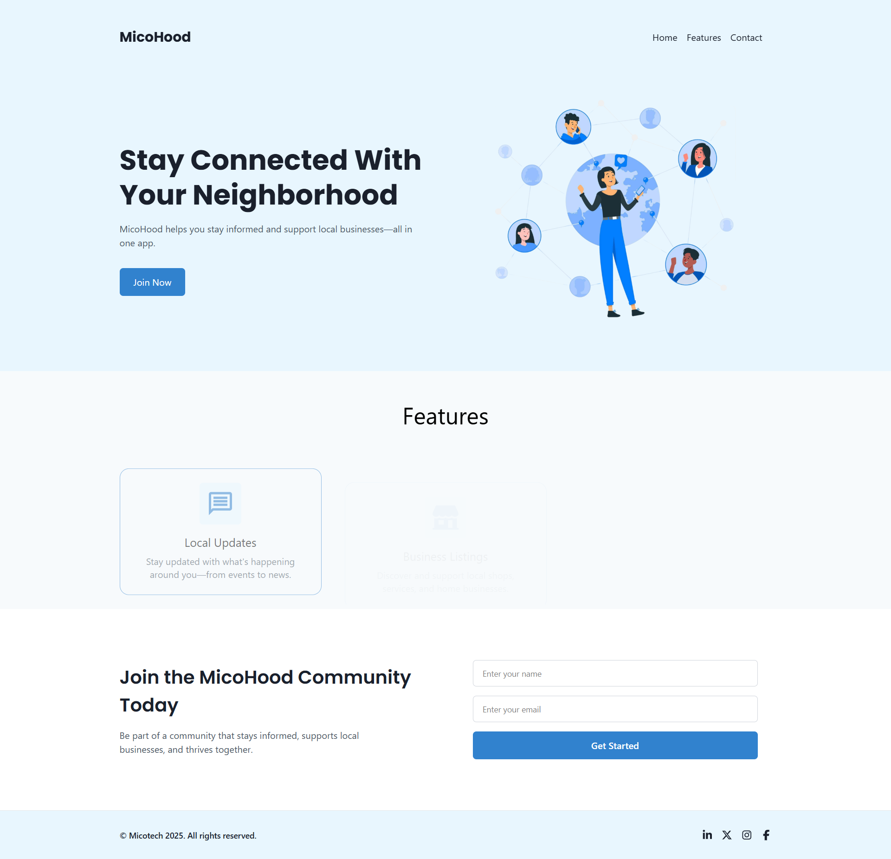

# MicoHood – Community Landing Page 🏘️

A responsive landing page for **MicoHood**, the neighborhood community app by **Micotech**.


---

## 📋 Task Description

**Task Title:**  
Create a Simple Community Landing Page for “MicoHood”

**Objective:**  
Build a single responsive web page that introduces MicoHood, Micotech’s neighborhood community app.

---

## 📦 What to Include

- ✅ **Header** – with the app name “MicoHood” and basic navigation
- ✅ **Hero Section** – title, short description, and a “Join Now” button
- ✅ **Features Section** – highlight 3 key features (e.g., Local Updates, Business Listings, Safety Tips)
- ✅ **Join Form** – name and email input (no backend)
- ✅ **Footer** – with “@Micotech 2025”
- ✅ **Mobile Responsive Layout**

---

## 🛠 Tools Used

- ✅ **React.js** (preferred framework)
- ✅ **Tailwind CSS** (for fast and responsive styling)
- ✅ **Framer Motion** (for entry animations)
- ✅ **React Scroll** (smooth navigation)
- ✅ **React Icons** (social media icons)

---

## 🌐 Live Preview

👉 [Visit Live Site](https://mico-hood-landing-page.vercel.app/)

📁 [View GitHub Repository](https://github.com/Faruqoloyede/MicoHood_landing-page)

---

## 🚀 Setup Instructions

```bash
# Clone the repository
git clone https://github.com/Faruqoloyede/MicoHood_landing-page.git
cd Micohood-landing

# Install dependencies
npm install

# Start the development server
npm run dev



